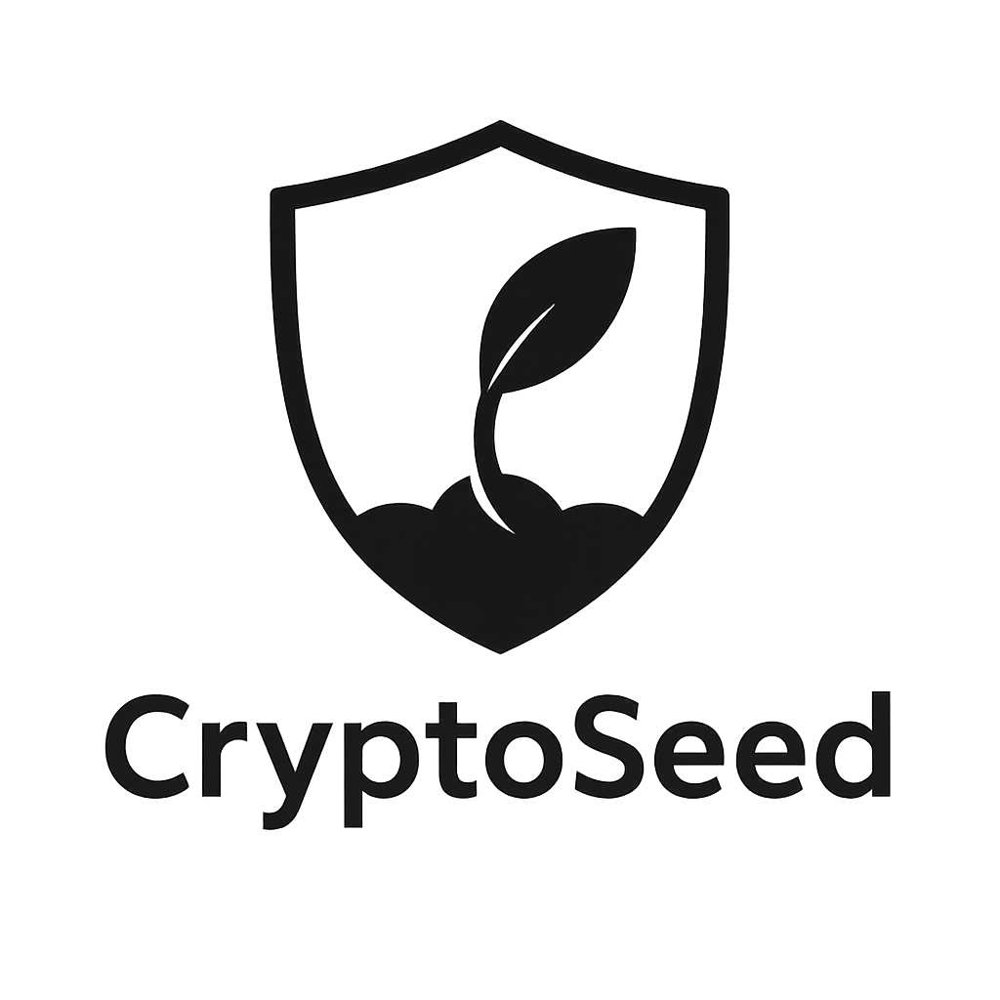

# CryptoSeed

**CryptoSeed** is a modern, open-source, client-side encryption app for securely encrypting and decrypting text, seed phrases, and files. Built with React and Vite, CryptoSeed uses strong cryptography and best security practices to keep your secrets safe—entirely in your browser, with no server-side data or tracking.

---

## 🚀 Features
- **AES-256-GCM encryption** for text, seed phrases, and files
- **PBKDF2 password strengthening** (600,000 rounds, SHA-256)
- **Password strength meter** and secure password input
- **Clipboard auto-wipe** and session timeout for sensitive data
- **Secure memory wiping** after cryptographic operations
- **Offline-first PWA**: works fully offline after first load
- **No server-side data**: all encryption/decryption is local
- **Modern UI/UX** with accessibility and mobile support
- **A+ Security Headers**: passes Mozilla Observatory with top score

---

## 🖥️ Demo
Live: [https://effortless-marigold-bb242d.netlify.app/](https://effortless-marigold-bb242d.netlify.app/)



---

## ⚡ Quick Start

```bash
# Clone the repo
git clone https://github.com/PurpleBass/cryptoseed.git
cd cryptoseed

# Install dependencies
npm install

# Start the development server
npm run dev

# Build for production
npm run build

# Preview production build
npm run preview
```

---

## 🛡️ Security
- **All encryption is client-side** using the Web Crypto API
- **No data is ever sent to a server**
- **Strict security headers** (HSTS, CSP, X-Frame-Options, etc.)
- **frame-ancestors 'none'** in CSP and X-Frame-Options: DENY
- **A+ on Mozilla Observatory** (after deployment)

---

## 📦 Deployment
- Deploys easily to Netlify, Vercel, or any static host
- Security headers are set via the `/public/_headers` file (for Netlify)
- For other hosts, configure headers as per their documentation

---

## 🤝 Contributing
Pull requests, issues, and suggestions are welcome! Please open an issue or PR on GitHub.

---

## 📄 License
[GPL-3.0](LICENSE)

---

## 🙏 Credits
- Built with [React](https://react.dev/), [Vite](https://vitejs.dev/), and [Tailwind CSS](https://tailwindcss.com/)
- Cryptography via the [Web Crypto API](https://developer.mozilla.org/en-US/docs/Web/API/Web_Crypto_API)
- UI icons from [Lucide](https://lucide.dev/)

---

**CryptoSeed**: Secure your secrets. Own your privacy.

